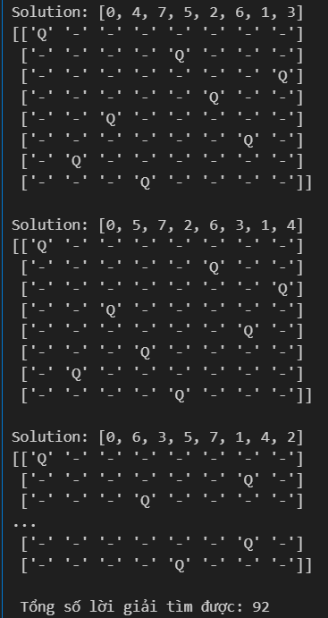

#  LAB 02 – ARTIFICIAL INTELLIGENCE  
##  THỰC HÀNH 06 & 07: Bài toán N-Queens

##  Nội dung thực hành

### 1. Bài toán 4-Queens (TH06)

- **Đề bài mô tả**:  
  Đặt 4 quân hậu lên bàn cờ 4x4 sao cho không có 2 quân hậu nào tấn công lẫn nhau.  
  Quân hậu có thể tấn công theo:
  - Cùng hàng (ngang)
  - Cùng cột (dọc)
  - Đường chéo chính và phụ

- **Yêu cầu đề bài**:
  - Sinh tất cả các cấu hình có thể cho 4 quân hậu.
  - Kiểm tra tính hợp lệ của từng cấu hình.
  - In ra các lời giải thỏa mãn và hiển thị theo cả dạng bảng và tọa độ.

- **Kết quả**:
  - Kết quả bài toán `1` :

---

### 2. Bài toán 8-Queens (TH07)

- **Mô tả**:  
  Mở rộng từ bài toán 4-Queens lên bàn cờ 8x8. Đặt 8 quân hậu sao cho không quân nào tấn công quân khác.

- **Yêu cầu**:
  - Cài đặt thuật toán backtracking để tìm mọi lời giải.
  - In ra tổng số lời giải tìm được.
  - In ra một vài lời giải mẫu minh họa (dưới dạng ma trận bàn cờ và danh sách tọa độ).

- **Kết quả **:
  - Kết quả bài toán `2` :

---

